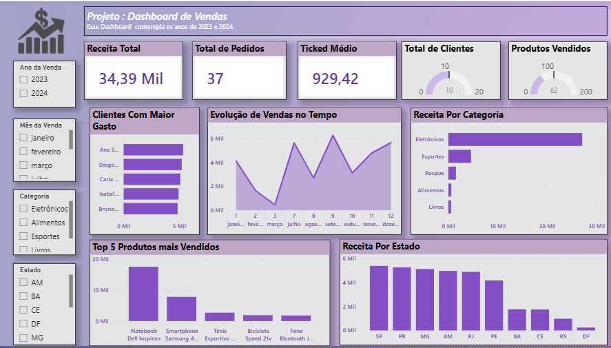

# 📊 Dashboard de Vendas Analytics
### Pipeline de dados: MySQL → Power BI


---



## 🎯 Sobre o Projeto

Projeto de análise de dados de uma empresa fictícia de e-commerce.  
Cobre desde a **modelagem do banco de dados no MySQL** até a **visualização interativa no Power BI**, demonstrando um fluxo real de trabalho com dados.

---

## 🗂️ Estrutura do Projeto

```
projeto-vendas-analytics/
│
├── sql/
│   ├── schema.sql           # Criação das tabelas
│   ├── inserts.sql          # Dados fictícios
│   └── queries_analise.sql  # Análises em SQL puro
│
├── powerbi/
│   └── dashboard_vendas.pbix
│
├── imagens/
│   └── screenshot_dashboard.png
│
└── README.md
```

---

## 🔄 Fluxo do Pipeline

```
MySQL                          Power BI
  │                               │
  │  Modelagem, dados e   ──────► │  Visualização interativa
  │  queries analíticas           │  e KPIs de negócio
```

---

## 🛠️ Tecnologias Utilizadas

| Ferramenta | Finalidade |
|------------|-----------|
| **MySQL 8** | Modelagem relacional e SQL analítico |
| **Power BI Desktop** | Dashboard interativo |

---

## 📌 O que foi feito em cada etapa

### 1. 🗄️ MySQL
- Modelagem relacional com 4 tabelas: `clientes`, `produtos`, `categorias` e `vendas`
- Relacionamentos com chaves primárias e estrangeiras
- Coluna calculada `total` (quantidade × preço)
- Queries analíticas prontas: ranking de produtos, receita por estado, ticket médio e evolução mensal

### 2. 📊 Power BI
- Conexão direta com o banco MySQL via view `vw_vendas_completas`
- KPIs: Receita Total, Total de Pedidos, Ticket Médio, Total de Clientes e Produtos Vendidos
- Gráfico de barras horizontal: Clientes com Maior Gasto
- Gráfico de linhas: Evolução de Vendas no Tempo
- Gráfico de barras horizontal: Receita por Categoria
- Gráfico de barras: Top 5 Produtos mais Vendidos
- Gráfico de barras: Receita por Estado
- Filtros interativos por Ano da Venda, Mês da Venda, Categoria e Estado

---

---

## 📈 Insights do Dashboard

- 📦 **Eletrônicos** lideram com R$ 27.093,80 em receita total
- 🗺️ **SP e PR** são os estados com maior volume de vendas
- 💰 Ticket médio de **R$ 929,42** por pedido

---

## 👤 Autor

**Letícia Felix**

Linkedin: https://www.linkedin.com/in/letícia-barreto-felix-b2a629204?utm_source=share_via&utm_content=profile&utm_medium=member_ios


GitHub: https://github.com/LeticiaFelix0

---

> 💡 *Projeto desenvolvido para demonstração de habilidades em SQL e Power BI.*
